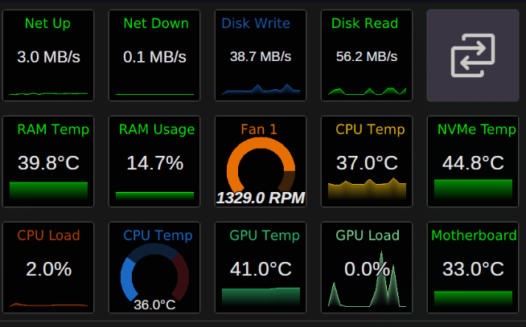

# Hardware Graphs

A configurable OpenDeck plugin that displays real-time hardware sensor data as interactive graphs.

## Features

- Monitor CPU, GPU, RAM, and other hardware sensors
- Display metrics as live timeseries graphs on your Stream Deck
- Fully configurable to track the sensors you care about

## Installation

Install via OpenDeck plugin manager or manually place in your plugins directory.

## Usage

Add the Hardware Graph action to any key and configure which sensor to monitor through the property inspector.

